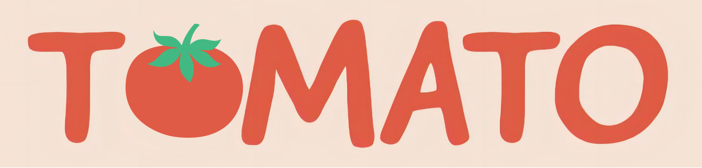
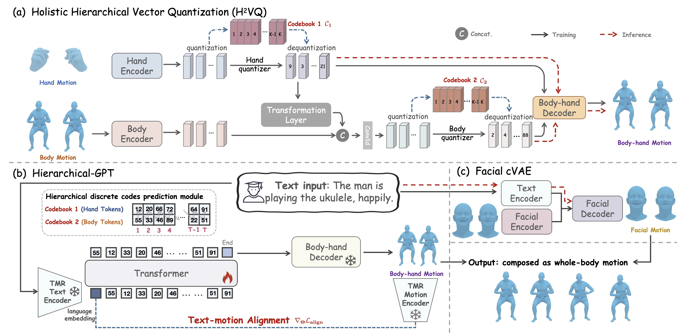

# HumanTOMATO: Text-aligned Whole-body Motion Generation



[Shunlin Lu](https://shunlinlu.github.io)<sup>🍅 2, 3</sup>, [Ling-Hao Chen](https://lhchen.top)<sup>🍅 1, 2</sup>, [Ailing Zeng](https://ailingzeng.site)<sup>2</sup>, [Jing Lin](https://jinglin7.github.io)<sup>1, 2</sup>, [Ruimao Zhang](http://zhangruimao.site)<sup>3</sup>, [Lei Zhang](https://leizhang.org)<sup>2</sup>, and [Heung-Yeung Shum](https://scholar.google.com/citations?user=9akH-n8AAAAJ&hl=en)<sup>1, 2</sup>

<sup>🍅</sup>Co-first author. Listing order is random. 

<sup>1</sup>Tsinghua University, <sup>2</sup>International Digital Economy Academy (IDEA),
<sup>3</sup>School of Data Science, The Chinese University of Hong Kong, Shenzhen (CUHK-SZ)

<p align="center">
  <a href='https://arxiv.org/abs/2310.12978'>
  
  </a> 
  <a href='https://arxiv.org/pdf/2310.12978.pdf'>
  
  </a> 
  <a href='https://lhchen.top/HumanTOMATO'>
  </a> 
  <a href='https://youtu.be/PcxUzZ1zg6o'>
  </a> 
  <a href='https://www.bilibili.com/video/BV1xH4y1973x/'>
    </a>
  <a href='https://github.com/IDEA-Research/HumanTOMATO'>
  </a> 
  <a href='LICENSE'>
  
  </a> 
  <a href="" target='_blank'>
  
  </a> 
</p>

# 🤩 Abstract
> This work targets a novel text-driven whole-body motion generation task, which takes a given textual description as input and aims at generating high-quality, diverse, and coherent facial expressions, hand gestures, and body motions simultaneously. Previous works on text-driven motion generation tasks mainly have two limitations: they ignore the key role of fine-grained hand and face controlling in vivid whole-body motion generation, and lack a good alignment between text and motion. To address such limitations, we propose a <u>T</u>ext-aligned wh<u>O</u>le-body <u>M</u>otion gener<u>AT</u>i<u>O</u>n framework, named HumanTOMATO, which is the first attempt to our knowledge towards applicable holistic motion generation in this research area. To tackle this challenging task, our solution includes two key designs: (1) a <u>H</u>olistic <u>H</u>ierarchical VQ-VAE (aka H²VQ) and a Hierarchical-GPT for fine-grained body and hand motion reconstruction and generation with two structured codebooks; and (2) a pre-trained text-motion-alignment model to help generated motion align with the input textual description explicitly. Comprehensive experiments verify that our model has significant advantages in both the quality of generated motions and their alignment with text.


# 📢 News

- **[2024/05/13] Release OpenTMA project. It is exactly the text-motion alignment used in HumanTOMATO.**
- **[2024/05/02] HumanTOMATO is accepted by ICML-2024. See you in Vienna!**
- **[2023/11/15] Publish HumanTOMATO Motion Representation (`tomato` representation) processing code.**
- **[2023/10/22] Publish project!**

# 🎬 Highlight Whole-body Motions


The proposed HumanTOMATO model can generate text-aligned whole-body motions with vivid and harmonious face, hand, and body motion. We show two generated qualitative results.


# 🔍 System Overview


The framework overview of the proposed text-driven whole-body motion generation. (a) Holistic Hierarchical Vector Quantization (H²VQ) to compress fine-grained body-hand motion into two discrete codebooks with hierarchical structure relations. (b) Hierarchical-GPT using motion-aware textual embedding as the input to hierarchically generate body-hand motions. (c) Facial text-conditional VAE (cVAE) to generate the corresponding facial motions. The outputs of body, hand, and face motions comprise a vivid and text-aligned whole-body motion.


# 🚀 Quick Start


# 🚅 Model Training


# 📸 Visualization


# 🤝🏼 Citation
If you find the code is useful in your research, please cite us: 
```bash
@article{humantomato,
  title={HumanTOMATO: Text-aligned Whole-body Motion Generation},
  author={Lu, Shunlin and Chen, Ling-Hao and Zeng, Ailing and Lin, Jing and Zhang, Ruimao and Zhang, Lei and Shum, Heung-Yeung},
  journal={arxiv:2310.12978},
  year={2023}
}
```

## 📚 License

This code is distributed under an [IDEA LICENSE](LICENSE). Note that our code depends on other libraries and datasets which each have their own respective licenses that must also be followed.

## 💋 Acknowledgement

The code is on the basis of [TMR](https://github.com/Mathux/TMR), [MLD](https://github.com/ChenFengYe/motion-latent-diffusion), [T2M-GPT](https://github.com/Mael-zys/T2M-GPT), and [HumanML3D](https://github.com/EricGuo5513/HumanML3D). Thanks to all contributors!

## 🌟 Star History

<p align="center">
    <a href="https://star-history.com/#IDEA-Research/HumanTOMATO&Date" target="_blank">
        
    </a>
<p>

If you have any question, please contact at: shunlinlu0803 [AT] gmail [DOT] com AND thu [DOT] lhchen [AT] gmail [DOT] com.
